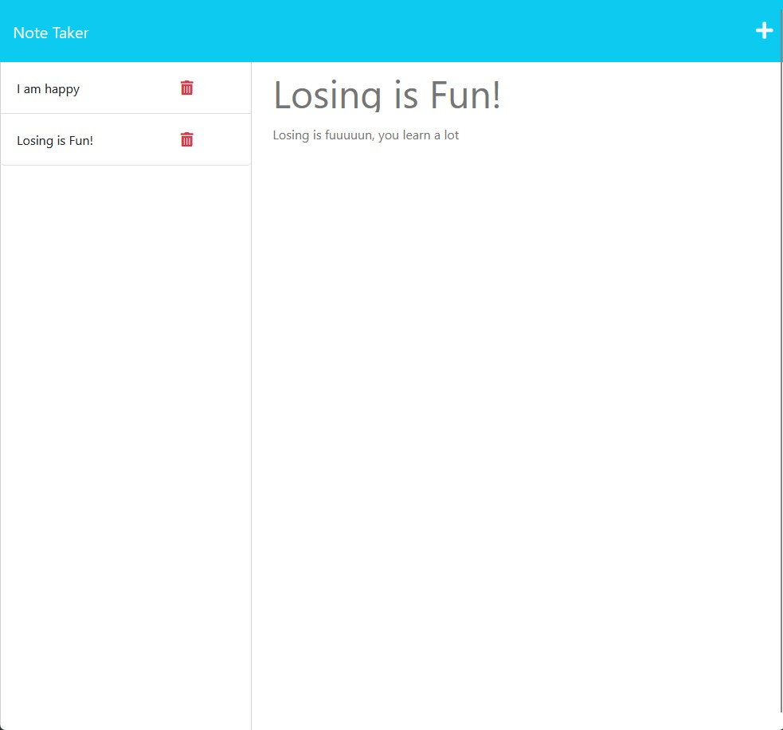

# Note Taker

## Description

A web application that allows the user to write and delete notes via requests to a server

Visit the Application: 

## Table of Contents

- [Installation](#installation)

- [Usage](#usage)

- [Contribution](#contribution-guidelines)

- [Test](#test-instructions)

- [License](#license)

## Installation

N/A

## Usage

Write a note with a title and a text and add it to a list of notes, afterwards you can delete it if you want or read it again

## Contribution Guidelines

Please fork the project before contributing

## Test Instructions

N/A

## Questions

Find me on github: [Alejandro-jpeg](https://github.com/Alejandro-jpeg)

## License

N/A

